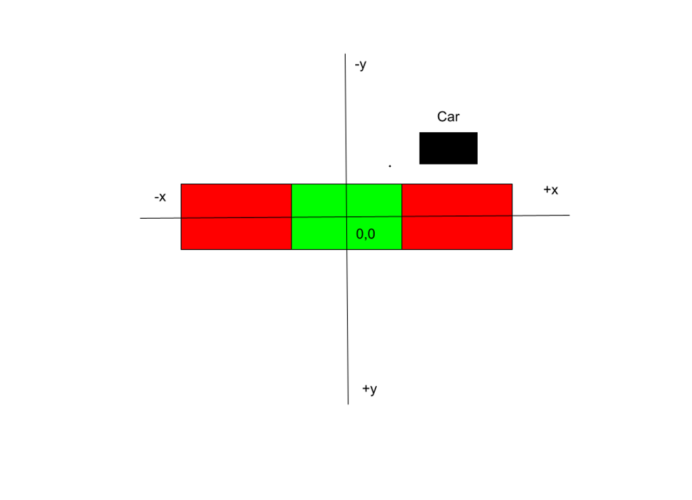
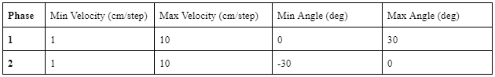
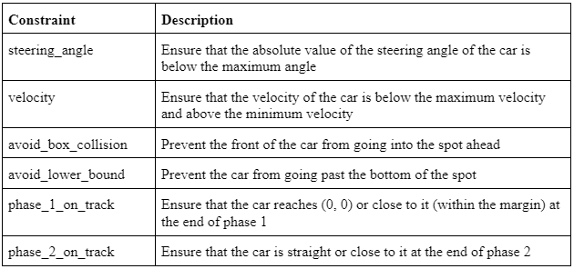
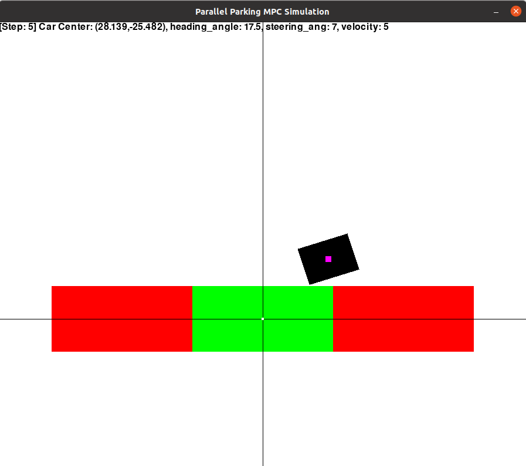
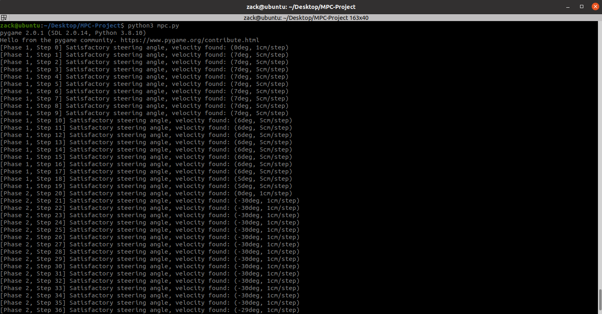

# Model Predictive Controller Simulation

*Software and writeup by Zack Waxler, physical implementation & testing by Theodore Gouskos and Jacky Chen He*

### Project in Brief

For this project, we were tasked with creating a model-predictive controller to govern the movement of a parallel parking car. We used the PyGame library to display the simulation in real time. 

### How to Run

```pip3 install pygame```

```python3 mpc.py```

### Project Structure

mpc.py - This is the main project file. It contains the core logic for the simulation including steps, phases, and the MPC lookahead functionality.

car.py - This file contains information about the MPC car, as well as a move function to update its position for each time step.

box.py - This file contains information about the parking spaces, which is referenced throughout the project.

constraints.py - This file contains the MPC constraints imposed on the movement of the car at each step in the simulation.

display.py - This file contains the logic for correctly displaying the state of the simulation on the screen using a PyGame thread.

## Project Design & Overview



### MPC Overview

The core functionality of the simulation is the MPC lookahead. At each step in our simulation, the MPC performs a lookahead of 20 steps (out of 41 total steps) to make an educated decision about how to proceed. The parallel parking procedure has three phases: getting in position, straightening the car, and straightening the wheels. The first phase is carried out during steps 0-20, and the second phase is carried out during steps 20-40. The third phase is simply a 1-step action of straightening the wheels. After the lookahead, a feasible velocity value and steering angle are generated to carry out the movement for the current step. For simplicity, we used a constant velocity and steering angle value for each lookahead step. Possible steering angles and velocities are determined using the following criteria:



When determining a viable path, we ensure that all of the MPC constraints defined below hold for each step in the lookahead. We also favor lower velocities and lower steering angles whenever possible.

### MPC Constraints



We ended up going with a different, but similar set of MPC constraints for this simulation. These constraints ensure that both phase 1 and 2 are completed successfully, while also allowing for some flexibility in terms of variables like box size, car size, etc. 

## Simulating Error
As this simulation is frame perfect by nature of being virtual, we decided to throw in some artificial actuation errors (ie. small random changes in the car’s position) to show off the robustness of our MPC. To enable artificial errors, change the value of ADD_ERRORS to True in the mpc.py file. As you can see after enabling this setting, the car will usually still end up parking correctly. Occasionally, it will encounter a fatal point where it’s unable to find a path when the errors prove to be too much for the simulation to handle. 

## Pictures

Here's a screenshot of the simulation in action:



And here's an example of the console output where you can see the optimal values being computed at each step:



## Next Steps

This simulation isn’t perfect. A few optimizations that could be made to improve its performance are:
- Adding more constraints to further restrict the car’s movement (decreasing the heading angle in phase 1, making sure it’s more centered in the spot at the end of phase 2, etc.)
- Determining optimal steering angles and velocities for each step in the lookahead instead of using constant values for all 20 steps
- Optimizing for different conditions such as speed
